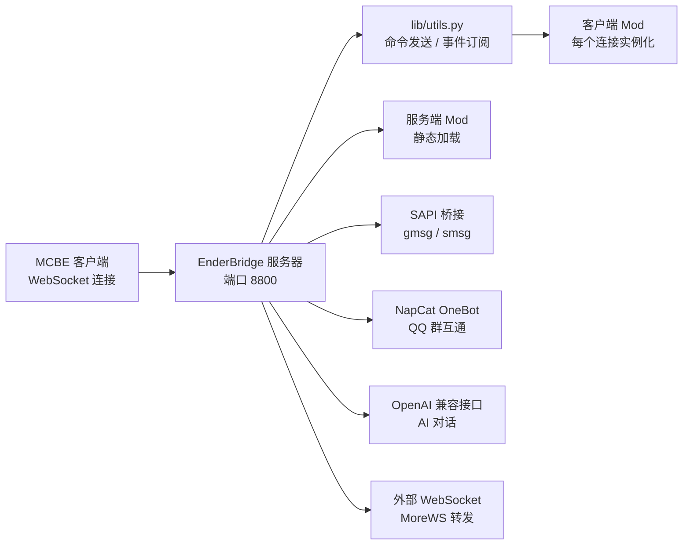

# ⛏️ EnderBridge

> Minecraft 基岩版（Bedrock Edition）服务器端模组加载框架 —— 通过 WebSocket 桥接游戏客户端，加载并运行你的自定义模组。
> A mod loader framework for Minecraft Bedrock Edition — bridges the game client over WebSocket and loads your custom mods.

EnderBridge 是一个用 Python 编写的 MCBE 模组加载器，它启动一个 WebSocket 服务器等待游戏客户端连入，并以「客户端 Mod / 服务端 Mod」两层结构加载扩展。内置 AI 对话、QQ 群互通、音乐播放、图片转像素画、Ezmatic 建筑导入等模组，开箱即用。

EnderBridge is a Python-based mod loader for Minecraft Bedrock Edition. It runs a WebSocket server waiting for game clients, then loads extensions in a two-layer architecture of **Client Mods / Server Mods**. It ships with built-in mods: AI chat, QQ bridge, music playback, image-to-pixel-art, and Ezmatic build import — ready to use out of the box.

---

## ✨ 特性 / Features

- 🧩 **模组加载框架 / Mod loading framework**：客户端 Mod（每个连接实例化）与服务端 Mod（静态）两层架构，动态导入 + 热重载
- 🌐 **WebSocket 桥接 / WebSocket bridge**：默认监听 `8800` 端口，支持多客户端并存，首个连接自动成为主客户端
- 🤖 **AI 对话 / AI chat**：OpenAI 兼容接口（默认 DeepSeek），支持对话 / 指令两种模式
- 💬 **QQ 群互通 / QQ bridge**：通过 NapCat（OneBot v11 协议）实现 QQ 群消息与游戏内消息双向转发
- 🎵 **音乐播放 / Music playback**：解析 MIDI/JSON 音乐，映射为游戏内 `playsound` 音效
- 🖼️ **图片像素画 / Image to pixel art**：按 HSV/LAB 颜色匹配调色板，自动生成 MC 像素画
- 🏗️ **Ezmatic 导入 / Ezmatic import**：解析 Java 版 `.litematic` 建筑并转换为基岩版结构
- 🛡️ **权限系统 / Permission system**：owner / op / user / blocker 四级权限，命令分级执行
- 🚦 **命令限流 / Command rate limit**：按玩家分桶的窗口限流，防刷屏
- 🔧 **图形化配置向导 / Web setup wizard**：首次运行自动打开浏览器向导（`http://127.0.0.1:18888`），无需手改配置
- 🩹 **依赖自愈 / Dependency self-healing**：缺少依赖自动安装；`config.py` / `permission.json` 缺失自动从模板生成
- 🗺️ **跨平台路径兼容 / Cross-platform paths**：Windows / Android / Linux 统一相对路径写法

---

## 📦 环境要求 / Requirements

| 项目 / Item | 要求 / Requirement |
|------|------|
| Python | 3.8+（推荐 3.10+ / recommended 3.10+） |
| 游戏 / Game | Minecraft 基岩版（支持 WebSocket 连接，如 BDS 服务器 / 基岩版客户端）<br/>Minecraft Bedrock with WebSocket support (e.g. BDS server / Bedrock client) |
| QQ（可选 / optional） | NapCat 等 OneBot v11 实现 / NapCat or other OneBot v11 implementations |

依赖清单 / Dependencies（`requirements.txt`）：`websockets`、`Pillow`、`mido`、`openai`、`websocket-client`

---

## 🚀 快速开始 / Quick Start

### 1. 安装依赖 / Install dependencies

```bash
python setup.py
```

> 直接运行 `python main.py` 时也会自动检测依赖，缺失会自动调用 `setup.py` 安装。
> Running `python main.py` also auto-detects missing dependencies and invokes `setup.py`.

### 2. 启动 / Start the server

```bash
python main.py
```

首次运行（或 `config.example.py` 中 `is_first_run = True`）会自动启动**图形化配置向导**，浏览器访问 `http://127.0.0.1:18888` 完成配置：

On first run (or when `is_first_run = True` in `config.example.py`), the **web setup wizard** starts automatically. Open `http://127.0.0.1:18888` in your browser to configure:

- 服务器名称、WebSocket 端口、命令前缀、日志等级 / Server name, WebSocket port, command prefix, log level
- AI API Key / Base URL / 对话模型 / 指令模型 / AI API Key / Base URL / chat model / command model
- 音乐打击乐开关、QQ 桥接（群号 / 主机 / 端口 / 访问令牌）/ Music percussion toggle, QQ bridge (group ID / host / port / access token)
- 命令限流（开关 / 时间窗口 / 窗口内最大次数）/ Command rate limit (toggle / window / max per window)
- 玩家权限（服主 / 管理员 / 普通用户 / 屏蔽名单）/ Player permissions (owner / op / user / blocker)

保存后自动生成 `config.py` 与 `permission.json`（旧文件备份为 `.bak`），**重启服务器生效**。

After saving, `config.py` and `permission.json` are generated (old files backed up as `.bak`). **Restart the server to apply.**

### 3. 在游戏内连接 / Connect from the game

1. 让游戏客户端连接到 WebSocket 服务器（端口与向导中配置的一致，默认 `8800`）/ Connect your game client to the WebSocket server (port as configured, default `8800`)
2. 第一个连接成为主客户端 / The first connection becomes the main client
3. 在游戏内使用命令前缀（默认 `!`）调用各模组命令，例如 `!tool help` 查看命令帮助 / Use the command prefix (default `!`) in-game to call mod commands, e.g. `!tool help`

### 4. 命令格式 / Command format

所有内置模组统一使用**单入口命令**：`<前缀><模组入口> <方法> <参数...>`，例如：

All built-in mods share a **single-entry command** format: `<prefix><entry> <method> <args...>`.

| 模组 / Mod | 入口 / Entry | 示例 / Example |
|------|------|------|
| 工具 / Tool | `tool` | `!tool help`、`!tool reload Ezmatic` |
| 图片 / Image | `image` | `!image create demo.png` |
| 音乐 / Music | `music` | `!music run <文件>` |
| 坐标 / Position | `pos` | `!pos a`、`!pos fill <方块>` |
| 权限 / Permission | `perm` | `!perm query Steve` |
| 函数 / MCFunc | `function` | `!function function <路径>` |
| 外接 WebSocket / MoreWS | `ws` | `!ws connect ws://127.0.0.1:8080` |
| QQ 互通 / QQ | `qq` | `!qq send 你好` |
| AI 对话 / AI | `ai` | `!ai chat 你好` |
| 终端 / Terminal | `read` | `!read list` |
| Ezmatic 建筑 / Ezmatic | `ezmatic` | `!ezmatic preview <文件>` |

每个入口输入 `help` 可查看该模组的全部方法：`!tool help`、`!music help`……

Type `help` after any entry to list all its methods: `!tool help`, `!music help`, ...

---

## 🛠️ 常用命令 / Commands

| 命令 / Command | 说明 / Description |
|------|------|
| `python main.py` | 正常启动服务器 / Start the server normally |
| `python main.py -set` / `--set` | 手动启动图形化配置向导（不重启服务器）/ Manually launch the setup wizard |
| `python main.py --reset-all` | 一键重置：删除 `config.py` / `permission.json` 及其备份，并将模板复位为首次运行状态 / Reset all configs and restore first-run state |
| `python setup.py` | 安装 / 检测依赖 / Install / check dependencies |
| `python setup.py --check` | 仅检测依赖是否齐全 / Check dependencies only |

---

## 📁 项目结构 / Project Structure

```
EnderBridge/
├── main.py                  # 入口：依赖自愈、配置生成、向导、WebSocket 服务器 / Entry: self-healing, config gen, wizard, WS server
├── config.py                # 真实配置（由向导生成）/ Actual config (generated by wizard)
├── config.example.py        # 配置模板（含 is_first_run 标记与平台检测）/ Config template
├── permission.json          # 玩家权限（由向导生成）/ Player permissions (generated by wizard)
├── setup.py                 # 依赖安装器 / Dependency installer
├── lib/                     # 核心库 / Core library
│   ├── command.py           # 命令框架（前缀、参数解析、限流）/ Command framework
│   ├── mods.py              # Mod 管理器（事件总线、动态导入、热重载）/ Mod manager
│   ├── utils.py             # WebSocket 工具（命令发送、事件订阅）/ WebSocket utilities
│   ├── sapi.py              # SAPI 桥接（gmsg / smsg 与服务器通信）/ SAPI bridge
│   ├── permission.py        # 权限管理（四级权限、原子写入）/ Permission manager
│   ├── logger.py            # 分级日志（控制台 + ./logs，北京时间）/ Logging
│   ├── setup.py             # 图形化配置向导（HTTP 18888）/ Setup wizard
│   └── ...
└── mod/                     # 模组目录 / Mods directory
    ├── ai.py                # AI 对话模组 / AI chat mod
    ├── mcfunc.py            # .mcfunction 执行（嵌套、定时循环）/ .mcfunction executor
    ├── morews.py            # 扩展 WebSocket 双向转发 / Extra WebSocket forwarder
    ├── music.py             # MIDI 音乐播放 / MIDI music player
    ├── permission.py        # 游戏内权限命令 / In-game permission commands
    ├── position.py          # 坐标 / 区域 / 结构操作 / Position & structure ops
    ├── read.py              # 终端交互模组 / Terminal interaction mod
    ├── tool.py              # 工具 / 命令帮助 / 管理 / Tools & command help
    ├── image/               # 图片转像素画 / Image to pixel art
    ├── ezmatic/             # Ezmatic 建筑导入 / Ezmatic build import
    └── qq/                  # QQ 群互通（NapCat）/ QQ bridge (NapCat)
```

---

## 🧩 内置模组 / Built-in Mods

| 模组 / Mod | 加载位置 / Load | 功能 / Description |
|------|----------|------|
| `AI` | 客户端 + 服务端 / Client + Server | 与 AI 模型对话（单次 / 上下文模式）/ Chat with AI (single / context mode) |
| `PermissionCommands` | 客户端 / Client | 游戏内权限查询与增删（`!perm query` / `!perm add` / `!perm remove`）/ In-game permission management |
| `Tool` | 客户端 / Client | 命令帮助（`!tool help` 分页）、搜索、终端执行、SAPI 控制 / Command help, search, terminal exec |
| `Position` | 客户端 / Client | A/B 点标记、距离计算、区域填充、结构复制 / 粘贴 / 剪切 / Coordinates & structure ops |
| `Music` | 客户端 / Client | 解析 MIDI/JSON 并播放为游戏音效 / Play MIDI/JSON as in-game sounds |
| `MCFunc` | 客户端 / Client | 加载执行 `.mcfunction` 文件，支持嵌套与定时循环 / Run .mcfunction files |
| `MoreWS` | 客户端 / Client | 同时连接多个外部 WebSocket 服务端并双向转发 / Multi-WebSocket forwarding |
| `Ezmatic` | 客户端 / Client | `.litematic` 建筑导入、预览、修复、导出 `.mcstructure` / Build import & export |
| `ImageMod` | 客户端 / Client | 图片转 MC 像素画（HSV/LAB 颜色匹配）/ Image to pixel art |
| `QQ` | 客户端 / Client | QQ 群消息与游戏内消息互通 / QQ ↔ in-game chat bridge |
| `read` | 服务端 / Server | 终端命令：重载 Mod、列出连接、消息推送 / Terminal commands, reload, push |

---

## ⚙️ 配置说明 / Configuration

### 核心配置 / Core config（`config.py`）

| 配置项 / Key | 默认值 / Default | 说明 / Description |
|--------|--------|------|
| `wsConfig.name` | `"EnderBridge"` | WebSocket 服务器名称 / Server name |
| `wsConfig.port` | `8800` | WebSocket 端口 / WebSocket port |
| `commandPrefix` | `!` | 游戏内命令前缀 / In-game command prefix |
| `logLevel` | `"info"` | 日志等级 / Log level：`debug` < `info` < `warning` < `error` |
| `rateLimit.command` | `enabled: False, windowMs: 1000, maxPerWindow: 20` | 命令限流：开关、时间窗口（毫秒）、窗口内最大次数 / Rate limit: toggle, window (ms), max per window |
| `features.qq` | 关闭 / off | QQ 桥接：群号、主机、端口、访问令牌 / QQ bridge settings |
| `AIConfig` | DeepSeek | AI 对话 / 指令模型、API Key、Base URL / AI models & API |
| `sapiConfig` | `gmsg` / `smsg` | 与服务器 SAPI 通信的命令名 / SAPI command names |

> 配置同时兼容驼峰与下划线写法（`rateLimit` / `rate_limit` 等），方便不同习惯。
> Both camelCase and snake_case keys are supported (`rateLimit` / `rate_limit`, etc.).

### 权限 / Permissions（`permission.json`）

四级权限 / Four levels：`owner`（服主，全部权限 / full access）→ `op`（管理员 / admin）→ `user`（普通用户 / normal user）→ `blocker`（屏蔽名单 / blocked）。可在配置向导中填写，或由游戏内命令维护。Set in the wizard or via in-game commands.

---

## 🔌 架构速览 / Architecture



- **客户端 Mod / Client Mods**：每个连接独立实例化，处理游戏内命令（`onCommand`）与消息（`onPocket`）/ Instantiated per connection, handle in-game commands and messages
- **服务端 Mod / Server Mods**：静态加载，处理服务器侧消息（`on_message`）/ Loaded statically, handle server-side messages
- 主客户端断开后全局状态自动重置，重连即恢复 / Global state resets when the main client disconnects; auto-recovers on reconnect

---

## ❓ 常见问题 / FAQ

**Q：首次启动没有自动打开配置向导？/ The wizard doesn't open on first run?**
检查 `config.example.py` 中 `is_first_run` 是否为 `True`，或直接运行 `python main.py -set` 手动打开向导。
Check `is_first_run` in `config.example.py`, or run `python main.py -set`.

**Q：向导保存报「模板匹配失败」？/ Wizard reports "template match failed"?**
确保 `config.example.py` 未被手动改动关键字段格式（向导按模板原文匹配替换）。
Ensure `config.example.py` keeps its original format (the wizard matches the template literally).

**Q：命令前缀改了不生效？/ Command prefix change doesn't take effect?**
前缀从 `config.py` 的 `commandPrefix` 读取，修改后需重启服务器。
The prefix is read from `commandPrefix` in `config.py`; restart the server after changes.

**Q：提示缺少依赖？/ Missing dependencies?**
运行 `python setup.py` 手动安装，或直接运行 `python main.py` 让其自动安装。
Run `python setup.py`, or just run `python main.py` to auto-install.

**Q：如何在 Android / Linux 上运行？/ How to run on Android / Linux?**
项目已内置平台检测与路径适配（`resolvePath`），统一使用相对路径即可跨平台运行。
Platform detection and path adaptation (`resolvePath`) are built in; use relative paths to run anywhere.

---

## 📄 许可 / License

本项目基于 [GPL-3.0](LICENSE) 许可证开源，仅供学习交流使用。Minecraft 及相关名称、商标归 Mojang Studios 所有。

This project is open-sourced under the [GPL-3.0](LICENSE) license. Minecraft and related names/trademarks belong to Mojang Studios.

---

*EnderBridge · Minecraft Bedrock 服务器管理框架*

