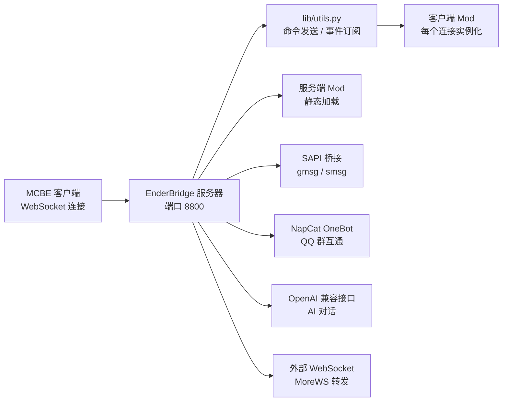

# ⛏️ EnderBridge

> Minecraft 基岩版（Bedrock Edition）服务器端模组加载框架 —— 通过 WebSocket 桥接游戏客户端，加载并运行你的自定义模组。

EnderBridge 是一个用 Python 编写的 MCBE 模组加载器，它启动一个 WebSocket 服务器等待游戏客户端连入，并以「客户端 Mod / 服务端 Mod」两层结构加载扩展。内置 AI 对话、QQ 群互通、音乐播放、图片转像素画、Litematic 建筑导入等模组，开箱即用。

---

## ✨ 特性

- 🧩 **模组加载框架**：客户端 Mod（每个连接实例化）与服务端 Mod（静态）两层架构，动态导入 + 热重载
- 🌐 **WebSocket 桥接**：默认监听 `8800` 端口，支持多客户端并存，首个连接自动成为主客户端
- 🤖 **AI 对话**：OpenAI 兼容接口（默认 DeepSeek），支持对话 / 指令两种模式
- 💬 **QQ 群互通**：通过 NapCat（OneBot v11 协议）实现 QQ 群消息与游戏内消息双向转发
- 🎵 **音乐播放**：解析 MIDI/JSON 音乐，映射为游戏内 `playsound` 音效
- 🖼️ **图片像素画**：按 HSV/LAB 颜色匹配调色板，自动生成 MC 像素画
- 🏗️ **Litematic 导入**：解析 Java 版 `.litematic` 建筑并转换为基岩版结构
- 🛡️ **权限系统**：owner / op / user / blocker 四级权限，命令分级执行
- 🚦 **命令限流**：按玩家分桶的窗口限流，防刷屏
- 🔧 **图形化配置向导**：首次运行自动打开浏览器向导（`http://127.0.0.1:18888`），无需手改配置
- 🩹 **依赖自愈**：缺少依赖自动安装；`config.py` / `permission.json` 缺失自动从模板生成
- 🗺️ **跨平台路径兼容**：Windows / Android / Linux 统一相对路径写法

---

## 📦 环境要求

| 项目 | 要求 |
|------|------|
| Python | 3.8+（推荐 3.10+） |
| 游戏 | Minecraft 基岩版（支持 WebSocket 连接，如 BDS 服务器 / 基岩版客户端） |
| QQ（可选） | NapCat 等 OneBot v11 实现 |

依赖清单（`requirements.txt`）：`websockets`、`Pillow`、`mido`、`openai`、`websocket-client`

---

## 🚀 快速开始

### 1. 安装依赖

```bash
python setup.py
```

> 直接运行 `python main.py` 时也会自动检测依赖，缺失会自动调用 `setup.py` 安装。

### 2. 启动

```bash
python main.py
```

首次运行（或 `config.example.py` 中 `is_first_run = True`）会自动启动**图形化配置向导**，浏览器访问 `http://127.0.0.1:18888` 完成配置：

- 服务器名称、WebSocket 端口、命令前缀、日志等级
- AI API Key / Base URL / 对话模型 / 指令模型
- 音乐打击乐开关、QQ 桥接（群号 / 主机 / 端口 / 访问令牌）
- 命令限流（开关 / 时间窗口 / 窗口内最大次数）
- 玩家权限（服主 / 管理员 / 普通用户 / 屏蔽名单）

保存后自动生成 `config.py` 与 `permission.json`（旧文件备份为 `.bak`），**重启服务器生效**。

### 3. 在游戏内连接

1. 让游戏客户端连接到 WebSocket 服务器（端口与向导中配置的一致，默认 `8800`）
2. 第一个连接成为主客户端
3. 在游戏内使用命令前缀（默认 `!`）调用各模组命令，例如 `!t:help` 查看命令帮助

---

## 🛠️ 常用命令

| 命令 | 说明 |
|------|------|
| `python main.py` | 正常启动服务器 |
| `python main.py -set` / `--set` | 手动启动图形化配置向导（不重启服务器） |
| `python main.py --reset-all` | 一键重置：删除 `config.py` / `permission.json` 及其备份，并将模板复位为首次运行状态 |
| `python setup.py` | 安装 / 检测依赖 |
| `python setup.py --check` | 仅检测依赖是否齐全 |

---

## 📁 项目结构

```
EnderBridge/
├── main.py                  # 入口：依赖自愈、配置生成、向导、WebSocket 服务器
├── config.py                # 真实配置（由向导生成，缺失时自动从模板生成）
├── config.example.py        # 配置模板（含 is_first_run 标记与平台检测）
├── permission.json          # 玩家权限（由向导生成）
├── setup.py                 # 依赖安装器
├── lib/                     # 核心库
│   ├── command.py           # 命令框架（前缀、参数解析、限流）
│   ├── mods.py              # Mod 管理器（事件总线、动态导入、热重载）
│   ├── utils.py             # WebSocket 工具（命令发送、事件订阅）
│   ├── sapi.py              # SAPI 桥接（gmsg / smsg 与服务器通信）
│   ├── permission.py        # 权限管理（四级权限、原子写入）
│   ├── logger.py            # 分级日志（控制台 + ./logs，北京时间）
│   ├── setup.py             # 图形化配置向导（HTTP 18888）
│   └── ...
└── mod/                     # 模组目录
    ├── ai.py                # AI 对话模组
    ├── mcfunc.py            # .mcfunction 执行（嵌套、定时循环）
    ├── morews.py            # 扩展 WebSocket 双向转发
    ├── music.py             # MIDI 音乐播放
    ├── permission.py        # 游戏内权限命令
    ├── position.py          # 坐标 / 区域 / 结构操作
    ├── read.py              # 终端交互模组
    ├── tool.py              # 工具 / 命令帮助 / 管理
    ├── image/               # 图片转像素画
    ├── litematic/           # Litematic 建筑导入
    └── qq/                  # QQ 群互通（NapCat）
```

---

## 🧩 内置模组

| 模组 | 加载位置 | 功能 |
|------|----------|------|
| `AI` | 客户端 + 服务端 | 与 AI 模型对话（单次 / 上下文模式） |
| `PermissionCommands` | 客户端 | 游戏内权限查询与增删（`p:query` / `p:add` / `p:remove`） |
| `Tool` | 客户端 | 命令帮助（`t:help` 分页）、搜索、终端执行、SAPI 控制 |
| `Position` | 客户端 | A/B 点标记、距离计算、区域填充、结构复制 / 粘贴 / 剪切 |
| `Music` | 客户端 | 解析 MIDI/JSON 并播放为游戏音效 |
| `MCFunc` | 客户端 | 加载执行 `.mcfunction` 文件，支持嵌套与定时循环 |
| `MoreWS` | 客户端 | 同时连接多个外部 WebSocket 服务端并双向转发 |
| `Litematic` | 客户端 | `.litematic` 建筑导入、预览、修复、导出 `.mcstructure` |
| `ImageMod` | 客户端 | 图片转 MC 像素画（HSV/LAB 颜色匹配） |
| `QQ` | 客户端 | QQ 群消息与游戏内消息互通 |
| `read` | 服务端 | 终端命令：重载 Mod、列出连接、消息推送 |

---

## ⚙️ 配置说明

### 核心配置（`config.py`）

| 配置项 | 默认值 | 说明 |
|--------|--------|------|
| `wsConfig.name` | `"EnderBridge"` | WebSocket 服务器名称 |
| `wsConfig.port` | `8800` | WebSocket 端口 |
| `commandPrefix` | `!` | 游戏内命令前缀 |
| `logLevel` | `"info"` | 日志等级：`debug` < `info` < `warning` < `error` |
| `rateLimit.command` | `enabled: False, windowMs: 1000, maxPerWindow: 20` | 命令限流：开关、时间窗口（毫秒）、窗口内最大次数 |
| `features.qq` | 关闭 | QQ 桥接：群号、主机、端口、访问令牌 |
| `AIConfig` | DeepSeek | AI 对话 / 指令模型、API Key、Base URL |
| `sapiConfig` | `gmsg` / `smsg` | 与服务器 SAPI 通信的命令名 |

> 配置同时兼容驼峰与下划线写法（`rateLimit` / `rate_limit` 等），方便不同习惯。

### 权限（`permission.json`）

四级权限：`owner`（服主，全部权限）→ `op`（管理员）→ `user`（普通用户）→ `blocker`（屏蔽名单）。可在配置向导中填写，或由游戏内命令维护。

---

## 🔌 架构速览



- **客户端 Mod**：每个连接独立实例化，处理游戏内命令（`onCommand`）与消息（`onPocket`）
- **服务端 Mod**：静态加载，处理服务器侧消息（`on_message`）
- 主客户端断开后全局状态自动重置，重连即恢复

---

## ❓ 常见问题

**Q：首次启动没有自动打开配置向导？**
检查 `config.example.py` 中 `is_first_run` 是否为 `True`，或直接运行 `python main.py -set` 手动打开向导。

**Q：向导保存报「模板匹配失败」？**
确保 `config.example.py` 未被手动改动关键字段格式（向导按模板原文匹配替换）。

**Q：命令前缀改了不生效？**
前缀从 `config.py` 的 `commandPrefix` 读取，修改后需重启服务器。

**Q：提示缺少依赖？**
运行 `python setup.py` 手动安装，或直接运行 `python main.py` 让其自动安装。

**Q：如何在 Android / Linux 上运行？**
项目已内置平台检测与路径适配（`resolvePath`），统一使用相对路径即可跨平台运行。

---

## 📄 许可

本项目为个人开源项目，仅供学习交流使用。Minecraft 及相关名称、商标归 Mojang Studios 所有。

---

*EnderBridge · Minecraft Bedrock 服务器管理框架*
