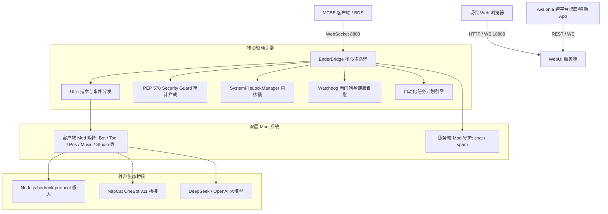

# EnderBridge Wiki

> Minecraft 基岩版 (Bedrock Edition) 服务器端模组加载框架&管理平台
> 通过 WebSocket 桥接游戏客户端，以「客户端 Mod / 服务端 Mod」两层架构加载扩展，并配备现代化 Web 管理面板与跨平台桌面/移动客户端。

---

## 📑 目录

1. [项目简介](#1-项目简介)
2. [安装部署](#2-安装部署)
3. [配置体系与向导](#3-配置体系与向导)
4. [Web 管理界面 (WebUI)](#4-web-管理界面-webui)
5. [跨平台客户端 App (桌面端与安卓端)](#5-跨平台客户端-app-桌面端与安卓端)
6. [配置项详解 (config.json)](#6-配置项详解-configjson)
7. [双层权限与安全防护体系](#7-双层权限与安全防护体系)
8. [命令系统与控制台直通](#8-命令系统与控制台直通)
9. [内置模组详解](#9-内置模组详解)
10. [模组开发指南](#10-模组开发指南)
11. [系统内核与高可用架构](#11-系统内核与高可用架构)
12. [常见问题与故障排查](#12-常见问题与故障排查)

---

## 1. 项目简介

EnderBridge 是一个专为 Minecraft 基岩版 (Bedrock Edition / BDS / 游戏客户端) 打造的高性能服务端模组加载与自动化运维框架。它启动一个 WebSocket 服务器等待游戏客户端接入，并以「客户端 Mod（随连接实例化）/ 服务端 Mod（静态守护）」两层架构提供强大的游戏内控制与外部扩展。

### 核心能力

| 能力 | 说明 |
|------|------|
| **WebSocket 桥接** | 默认监听 `8800` 端口，支持多客户端并发连接，首个连接自动设为主客户端并支持动态热切换 |
| **双层 Mod 架构** | 客户端 Mod（每个玩家连接独立实例，支持 SAPI/命令/消息）+ 服务端 Mod（单例后台常驻守护） |
| **现代化 Web 管理面板** | 默认监听 `18888` 端口，单页响应式应用，提供仪表盘、用户/角色权限、配置在线热更新、Mod 扫描/热重载、控制台、创意工坊 Studio、自动化任务计划、IP 封禁防火墙与审计日志 |
| **跨平台 App 客户端** | 基于 .NET 10 + Avalonia UI 12 构建的桌面端 (Windows/Linux/macOS) 及 Android APK 移动端控制台 |
| **内核级系统安全锁** | `SystemFileLockManager`（Windows 内核共享句柄 / POSIX flock）运行期锁定核心配置，杜绝外部恶意注入或误删改 |
| **解释器级安全守卫** | 基于 Python PEP 578 审计挂钩（`security_guard`），底层阻断第三方未授权 Mod 越权触碰系统文件 |
| **看门狗与自愈守护** | `Watchdog` 毫秒级监控事件循环健康状态与线程死锁，提供自动转储堆栈与保护性自愈重启 |
| **自动化任务计划引擎** | 原生纯 Python Cron 解析器与 Interval 定时引擎，支持游戏命令、系统指令与定时广播热调度 |
| **创意工坊 Studio** | 在线可视化管理 MIDI 音乐、MCFunc 脚本、Ezmatic 建筑蓝图（3D 体素交互预览）与图片像素画 |
| **全真假人 Bot 阵列** | 深度集成 Node.js `bedrock-protocol`，支持离线模式与多 Xbox Live 账号切换，假人直入 Tab 列表与世界 |
| **配置自愈与安全热重载** | 核心配置（`config.json`、`permission.json`、`users.json`、`banlist.json`）缺失自动从模板生成与版本无感升级 |

### 技术栈

- **服务端**：Python 3.12+ (推荐 3.13 / 3.14)
  - `websockets` (高并发异步 WebSocket 服务)
  - `Pillow` (像素画调色板提取与图像转换)
  - `mido` (MIDI 序列解析与 Note 音效映射)
  - `openai` (DeepSeek / OpenAI 兼容异步大模型)
  - `bcrypt` / `hashlib` (密码哈希算法安全存储)
  - `websocket-client` (QQ NapCat OneBot 同步桥接)
- **假人引擎**：Node.js 16+ + `bedrock-protocol`
- **桌面/移动端**：.NET 10 + Avalonia UI 12 (C#)

---

## 2. 安装部署

### 2.1 安装依赖

```bash
python setup.py            # 检测并自动安装 Python 依赖
python setup.py --check    # 仅检测环境是否完备 (退出码 0 为正常, 1 为缺失)
```

> 直接运行 `python main.py` 时会自动探测缺失依赖并无缝触发 `setup.py`。
> 若需要假人 Bot 功能，请确保系统已安装 Node.js 16+（且已加入环境变量 `PATH`）。

### 2.2 启动服务器

```bash
python main.py
```

服务端启动执行流程：
1. **环境与依赖探针**：检查 Python 解释器版本与 `websockets` 等核心依赖。
2. **配置文件自愈与加载**：优先读取 `config/config.json`（标准现代 JSON 格式），如缺失自动由 `config.example.json` 生成，同步准备 `permission.json`、`users.json`、`banlist.json` 与 `scheduler.json`。
3. **安全防护激活**：
   - 挂载 `security_guard`（PEP 578 解释器级审计拦截）；
   - 对核心配置与关键源码施加 `SystemFileLockManager` 系统级只读共享保护锁。
4. **OOBE 向导检测**：若检测到 `is_first_run: true`，自动弹出浏览器首次配置向导。
5. **服务监听建立**：启动 WebSocket 服务（默认 `8800`）、WebUI 管理面板服务（默认 `18888`）以及后台定时任务计划引擎与健康看门狗。

### 2.3 命令行参数

| 参数 | 说明 |
|------|------|
| `python main.py` | 正常启动服务器 |
| `python main.py --help` / `-h` | 显示命令行帮助信息并退出 |
| `python main.py --version` / `-v` | 显示当前版本号 (如 `v1.1.0.1`) |
| `python main.py --load-without-config` | 调试模式：跳过配置文件加载，使用内置缺省参数运行 |
| `python main.py --reset-all` | 一键初始化：删除所有生产配置及备份，复位首次运行状态 |
| `python main.py --system` | 启用系统保留账户模式（系统预留账户仅内置管理员可编辑） |
| `python main.py update <压缩包>` | 一键原子升级：从新版 zip/tar.gz 覆盖升级代码，绝对保留配置与资产 |
| `python main.py export [路径]` | 一键安全导出：打包当前代码为可分发 zip（自动排除用户隐私与运行时数据） |
| `python main.py --migrate-config` | 配置升级：将旧版 `config.py` 迁移到 `config.json` |
| `python setup.py` | 安装或检测缺失依赖 |

---

## 3. 配置体系与向导

EnderBridge 采用集中化 JSON 配置结构，所有运行时配置文件均放置于 `config/` 目录下：

```
config/
├── config.json              # 核心服务配置 (由向导生成或模板拷贝)
├── config.example.json      # 核心配置模板
├── permission.json          # 游戏内玩家权限名单 (owner/op/user/blocker)
├── users.json               # WebUI 登录账户与自定义角色权限表
├── banlist.json             # 封禁 IP 列表与自动封禁策略
└── scheduler.json           # 自动化定时与周期任务表
```

### 3.1 首次运行图形化向导 (OOBE)

当首次启动且 `config.json` 中 `is_first_run: true` 时，程序会在 `127.0.0.1:18888` 启动引导服务器并自动在默认浏览器中打开配置向导，提供表单化配置：
- 服务器名称、WebSocket 端口、游戏命令前缀、日志等级；
- 模组按需启用（AI、假人 Bot、QQ 互通、音乐、Ezmatic、像素画等）；
- AI 大模型提供商（API Key、Base URL、模型参数与冷却时间）；
- WebUI 端口与管理员初始凭据；
- 玩家初始权限与命令限流策略。

向导保存后立即原子写入 `config/config.json`，并将 `is_first_run` 置为 `false`，随后自动拉起正式服务，**无需重启终端**。

---

## 4. Web 管理界面 (WebUI)

WebUI 随主程序自动启动，默认访问地址：`http://127.0.0.1:18888`。

### 4.1 核心功能板块

| 板块 | 图标 | 功能说明 |
|------|------|----------|
| **仪表盘** | 📊 | 实时监控系统 CPU、内存占用、Python 运行时堆内存、网络/客户端连接数、服务器运行时间；支持一键优雅平滑重启 |
| **权限管理** | 👥 | 基于用户与角色的细粒度 RBAC 权限管理，支持创建用户、自定义角色、为单用户覆盖独立细粒度权限，并支持在页面直接管理游戏内 `permission.json` |
| **功能设置** | ⚙️ | 集中配置服务端口、命令前缀、命令别名、SAPI 参数、QQ 互通、AI 模型接入以及在线修改 `config.json` 并即时生效 |
| **Mod 管理** | 🧩 | 在线查看已加载的客户端与服务端 Mod、可导入状态、第三方 Mod 上传、开关禁用以及一键热重载 |
| **创意工坊 (Studio)** | 🎨 | 可视化管理 MIDI 音乐库、MCFunc 指令脚本、Ezmatic 建筑模型（支持 3D 体素交互预览、方块纹理包在线管理）与图片像素画 |
| **控制台 (Console)** | 💻 | 实时控制台：支持直接向已连接的 MCBE 客户端下发游戏命令；**同时支持以前缀开头的 EnderBridge 指令（如 `$bot start`、`$help`），即使无游戏客户端连接也能脱机秒级执行并回显** |
| **任务计划 (Scheduler)** | ⏰ | 支持 Interval 间隔与标准 5 字段 Cron 表达式定时执行游戏指令、终端命令、全服广播；提供单次手动测试与历史运行审计 |
| **封禁管理 (Banlist)** | 🚫 | IP 黑名单防火墙，支持单 IP/CIDR/批量封禁；内置登录暴力破解防御，在触发连续失败阈值后自动封禁来源 IP |
| **审计日志 (Audit)** | 📋 | 记录 WebUI 关键敏感操作（登录、配置变更、权限调整、Mod 重载、服务器重启），支持多维度过滤与日志导出 |
| **检查更新 (Update)** | 🔄 | 在线检查 GitHub Releases 最新版本、查看更新日志、一键自动更新升级并带两阶段自动探针重连与版本备份回滚 |

### 4.2 认证与细粒度权限 (RBAC)

WebUI 采用无状态安全 Token 鉴权（请求头 `X-Auth-Token`）：
- **admin 管理员**：拥有所有系统权限；首次启动时会在终端打印随机生成的强密码，登录后可在用户面板中修改。
- **operator 操作员**：默认拥有仪表盘、Mod 管理、Studio 工坊、控制台、封禁管理、审计日志与任务计划权限。
- **viewer 观察者**：只读权限，默认仅允许访问仪表盘与 Mod 列表。
- **guest 访客**：无需输入密码，点击登录界面的「以访客身份进入」即可快速查看仪表盘与 Mod 状态（只读）。

支持的 11 项细粒度权限元：
`dashboard`、`permissions`、`config`、`mods`、`studio`、`console`、`scheduler`、`audit`、`update`、`banlist`、`restart`。
管理员可以随时为特定用户设置「继承角色」、「明确允许」或「明确拒绝」，且**明确拒绝优先级最高**。

---

## 5. 跨平台客户端 App (桌面端与安卓端)

除 WebUI 外，项目配备基于 **.NET 10 + Avalonia UI 12** 开发的独立客户端（位于 `app/` 目录），提供桌面端与移动端的一体化管理体验：

- **桌面端 (Windows / Linux / macOS)**：
  - 原生深色亚克力毛玻璃界面，支持后台一键拉起、托管守护并优雅停止本机的 `python main.py`；
  - 内置高性能彩色控制台，可直接下发游戏与 EB 指令；
  - 源码位于 `app/src/EnderBridge.App.Desktop`，支持编译为跨平台独立可执行文件。
- **移动端 (Android APK)**：
  - 约 15MB 轻量级 APK 安装包，自适应竖屏触摸交互；
  - 通过局域网或公网 REST API / WebSocket 随时随地连接 EnderBridge 进行服务器运维；
  - 源码位于 `app/src/EnderBridge.App.Android`。

构建与运行指令：
```powershell
# 运行桌面端
dotnet run --project app/src/EnderBridge.App.Desktop/EnderBridge.App.Desktop.csproj

# 构建 Android APK
dotnet build app/src/EnderBridge.App.Android/EnderBridge.App.Android.csproj -c Release
```

---

## 6. 配置项详解 (config.json)

完整配置文件 `config/config.json` 核心字段说明：

```json
{
  "_version": "EBC0.3.6",
  "is_first_run": false,
  "wsConfig": {
    "name": "EnderBridge",
    "port": 8800
  },
  "webuiConfig": {
    "enabled": true,
    "port": 18888,
    "token": "",
    "localOnly": false,
    "autoBan": true,
    "autoBanConfig": {
      "window": 60,
      "threshold": 5,
      "banDuration": 10
    }
  },
  "logLevel": "info",
  "commandPrefix": "$",
  "botConfig": {
    "enabled": true,
    "mode": "server",
    "host": "127.0.0.1",
    "port": 19132,
    "offline": true,
    "version": null,
    "username": "FakeBot",
    "xboxAccounts": [],
    "activeXboxAccount": null
  },
  "features": {
    "music": { "playPercussion": true },
    "qq": { "enabled": false, "groupId": 123456789, "host": "127.0.0.1", "port": 3001, "accessToken": "" }
  },
  "mods": {
    "client": {
      "AI": "mod.ai",
      "PermissionCommands": "mod.permission",
      "Tool": "mod.tool",
      "Position": "mod.position",
      "Music": "mod.music",
      "MCFunc": "mod.mcfunc",
      "MoreWS": "mod.morews",
      "Ezmatic": "mod.ezmatic.main",
      "ImageMod": "mod.image.main",
      "Message": "mod.message",
      "Bot": "mod.bot"
    },
    "server": {
      "chat": "mod.read",
      "spam": "mod.spam"
    }
  },
  "commandAliases": {
    "bot": ["b"],
    "help": ["h", "?"],
    "message": ["msg", "m"],
    "music": ["m"],
    "tool": ["t"]
  },
  "messageConfig": {
    "agreement": { "enabled": true, "title": "📋 服务器协议", "text": "欢迎来到本服务器！" },
    "announcements": { "enabled": false, "interval": 300, "messages": [] }
  },
  "rateLimit": {
    "command": { "enabled": false, "windowMs": 1000, "maxPerWindow": 20 }
  },
  "AIConfig": {
    "options": { "baseURL": "https://api.deepseek.com", "apiKey": "" },
    "models": {
      "chat": { "model": "deepseek-chat", "max_tokens": 512 },
      "command": { "model": "deepseek-chat", "max_tokens": 1024 }
    }
  }
}
```

---

## 7. 双层权限与安全防护体系

### 7.1 操作系统级文件锁 (SystemFileLockManager)

为了杜绝外部独立进程、攻击注入脚本或用户编辑器意外修改/覆盖运行中的核心配置，EnderBridge 在运行时提供系统级文件加锁：
- **Windows**：通过 Win32 `CreateFileW` 持有 `FILE_SHARE_READ` 独占写入锁，外部进程无论通过文件追加、覆写还是 `os.replace` 均会触发 Windows 内核级的 `WinError 32 / WinError 5` 拒绝访问。
- **Linux / macOS**：通过 `fcntl.flock` 持有共享锁并结合只读权限属性（`stat.S_IREAD`）。
- **内部安全持久化通道**：当框架或官方授权 Mod 需要合法更新配置时，必须通过 `SystemFileLockManager.unlock_for_write(path)` 上下文管理器临时在微秒级时间内解锁、完成原子替换并立即自动恢复系统锁。

### 7.2 PEP 578 审计守卫 (Security Guard)

通过 Python 解释器底层的 `sys.addaudithook` 审计钩子，在底层拦截所有涉及 `open`（写/追加模式）、`os.remove`、`os.rename`、`os.replace` 等敏感操作：
- 当调用栈源自 `mod/` 目录时，守卫会自动检查是否企图向 `config/` 或核心系统源码写入；
- 若检测到第三方非授权 Mod 试图篡改配置，则直接在解释器层抛出 `PermissionError` 予以拦截；
- 官方 Mod 需持久化配置时，必须使用专有的 `save_mod_config(mod_name, patch)` 通道，且字段严格受限于白名单范围（Scope Isolation）。

### 7.3 游戏内玩家权限等级

在 `permission.json` 中定义游戏内玩家的权限分级：

| 等级值 | 权限标识 | 适用对象 | 权限说明 |
|:---:|:---:|:---:|---|
| `3` | **Owner** | 服主 | 拥有最高权限，可执行所有命令（包括 SAPI 控制、Mod 重载、假人 Bot 生成、权限授权等） |
| `2` | **OP** | 管理员 | 允许执行运维命令（如广播、执行基岩版原生命令 `tool cmd`、区域填充、建筑预览等） |
| `1` | **User** | 信任用户 | 可执行指定基础用户命令 |
| `0` | **Normal** | 普通玩家 | 仅可使用基础查询与交互命令（如 `help`、`ai chat`、`perm query`） |
| `< 0` | **Blocker** | 黑名单 | 彻底屏蔽，系统直接拒绝响应其所有指令 |

游戏内查询与修改命令：
- `$perm query [玩家名]`：查询自身或指定玩家权限
- `$perm add <owner|op|user|blocker> <玩家名>`：授予权限（需 Owner）
- `$perm remove <owner|op|user|blocker> <玩家名>`：移除权限（需 Owner）

---

## 8. 命令系统与控制台直通

### 8.1 统一单入口命令格式

内置模组统一遵循链式单入口语法：`<前缀><模组名> <子方法> [参数...]`。
例如前缀为 `$` 时：`$tool reload Bot`、`$bot spawn Steve`、`$music play bad_apple.mid`。
每个模组均内置 `$xxx help` 帮助查询，全局指令 `$help [页码]` 分页展示全部可用命令。

### 8.2 控制台直接执行 EB 前缀指令 (脱机支持)

以往游戏命令需要等待 MCBE 游戏客户端连入，而自 v1.1.0 起：
- **WebUI 控制台** 与 **桌面 App 控制台** 中输入以 `commandPrefix`（如 `$`）开头的指令（如 `$bot start`、`$bot list`、`$status`、`$help`）时；
- EnderBridge 会自动将其识别为系统内部指令并调度至对应 Mod 处理，**即使没有任何 Minecraft 客户端连接，也能脱机执行并即时回显输出结果**。

### 8.3 命令别名与玩家限流

- **命令别名**：在配置 `commandAliases` 中定义，如 `"bot": ["b"]`，则玩家输入 `$b spawn Steve` 完全等价于 `$bot spawn Steve`。
- **玩家防刷限流**：开启 `rateLimit.command.enabled: true` 后，系统按玩家名划分时间窗口（如 1000ms 内限 20 次），超额指令自动静默丢弃。

---

## 9. 内置模组详解

### 9.1 客户端模组 (Client Mods)

| 模组名称 | 配置键名 | 指令入口 | 主要功能与特性 |
|:---|:---|:---:|---|
| **Bot** | `Bot` | `bot` | 假人阵列：通过 Node.js 子进程启动 `bedrock-protocol` 接入 MCBE 服务器；支持假人生成 (`spawn`)、移除 (`remove`)、移动 (`move`)、发言 (`chat`)、多 Xbox 账号登录及状态展示 |
| **Tool** | `Tool` | `tool` | 核心运维工具：全局帮助分页 (`help`)、命令搜索、延时测试 (`ping`)、时间查询、SAPI 控制、主客户端切换及 Mod 动态热重载 |
| **Position** | `Position` | `pos` | 空间几何与建筑：A/B 点三维标记、体积/距离计算、带 64x64 tickingarea 自动切分的超大区域方块填充 (`fill`)，以及结构复制、剪切与粘贴 |
| **Ezmatic** | `Ezmatic` | `ezmatic` | Java 版 `.litematic` (NBT) 建筑导入：在基岩版世界进行方块投射、空间差异检测、坏块修复与导出为 `.mcstructure` |
| **Music** | `Music` | `music` | MIDI/JSON 音乐播放器：自动解析 MIDI 音轨，将音高精准映射为基岩版 `note.*` 原生乐器音效，支持打击乐与播放控制 |
| **ImageMod** | `ImageMod` | `image` | 图像转像素画：PIL 图像读取，基于 HSV 与 LAB 双色彩空间算法匹配 Minecraft 原生方块调色板，自动在游戏中构建像素画 |
| **AI** | `AI` | `ai` | 智能大模型对接：支持单轮与连续上下文对话 (`$ai chat`)，内置 `chatCooldown` 防刷机制与指令安全解析 |
| **MCFunc** | `MCFunc` | `function` | 宏脚本执行器：加载并执行本地 `.mcfunction` 脚本文件，支持最高 16 层函数递归嵌套与定时循环调度 |
| **Message** | `Message` | `message` | 终端向全服广播消息：支持协议确认弹窗与定时全服公告轮播 |
| **MoreWS** | `MoreWS` | `ws` | 外部 WebSocket 拓展转发：同时维护与多个第三方 WebSocket 服务器的常开连接与双向数据转发 |
| **QQ** | `QQ` | `qq` | QQ 群与游戏互通：对接 NapCat (OneBot v11) 实现双向消息互通 |
| **Permission**| `PermissionCommands` | `perm` | 游戏内权限管理：查询自身权限与服主实时加权/降权 |

### 9.2 服务端模组 (Server Mods)

| 模组名称 | 配置键名 | 指令入口 | 说明 |
|:---|:---|:---:|---|
| **chat** | `chat` | `chat` | 终端交互与会话：列出在线连接、重载 Mod、执行测试与格式化换行发言（终端与游戏内均可用） |
| **spam** | `spam` | `spam` | 压力测试与公告推送：包含定时广告推送 (`ad`)、文本攻击压力测试 (`attack`) 与紧急终止 (`stop`) |

---

## 10. 模组开发指南

### 10.1 编写客户端 Mod 范例

创建文件 `mod/hello.py`：

```python
import asyncio
from lib.command import Command
from lib.permission import PermissionManager

class Mod:
    def __init__(self, client):
        self.client = client  # ClientConnection 实例

    def onStart(self):
        """基础设施注入完成后自动调用"""
        self.logger.info("Hello Mod 启动成功！")

    def onCommand(self):
        """注册分级指令"""
        return {
            "normal": [
                Command.create("hello", "打招呼模组")
                .add_string("方法", False)
                .add_optional_string("参数1")
                .set_func(self._handle_cmd)
            ]
        }

    async def _handle_cmd(self, sender, method, p1=None, p2=None, p3=None, p4=None, p5=None):
        if method == "say":
            await self.client.tell(f"§a你好，{p1 or sender}！", sender)
        elif method == "help":
            await self.client.tell("§e用法: $hello say [名字]", sender)
        else:
            await self.client.tell("§c未知方法，请输入 $hello help", sender)
```

在 `config/config.json` 的 `mods.client` 中注册：
```json
"Hello": "mod.hello"
```
保存后，在控制台或游戏内输入 `$tool reload Hello` 即可无感热生效！

### 10.2 常用 API 速查

- **执行指令**：`await self.client.sendCommand("time set day")`
- **执行带返回值指令**：`res = await self.client.runCommand("testfor @a", timeout=5000)`
- **发送消息**：`await self.client.tell("§a消息", target="Steve")` / `await self.client.tellAll("广播")`
- **获取玩家坐标**：`pos = await self.client.getPosition(sender)` -> `{"x": 100, "y": 64, "z": 200}`
- **订阅游戏事件**：`self.client.subscribe("PlayerMessage", callback, owner=self.modName)`
- **持久化存储**：`self.storage.set("key", value)` / `self.storage.get("key")`
- **安全配置写入**：`from lib.mods import save_mod_config; save_mod_config("mymod", {"key": "val"})`

---

## 11. 系统内核与高可用架构



---

## 12. 常见问题与故障排查

**Q：首次运行 admin 密码忘记了怎么办？**
直接在终端使用命令重启服务，或查看首次启动日志；若依然无法找到，管理员拥有服务器主机权限时，可查看 `config/users.json`，或临时将密码哈希直接当作密码输入即可登录。

**Q：为什么修改 `config.json` 提示“文件被占用或没有写入权限”？**
EnderBridge 在运行时对关键配置文件持有了操作系统级文件保护锁（`SystemFileLockManager`），用于防御外部独立恶意脚本篡改配置。请直接通过 WebUI 面板的功能设置页进行在线修改和热保存，系统会在受控安全上下文内完成原子持久化。

**Q：控制台执行 `$bot` 指令提示未知命令？**
1. 确认已在 `config.json` 的 `mods.client` 中配置 `"Bot": "mod.bot"`。
2. 确认系统已安装 Node.js 16+ 并在终端中可执行 `node -v`。
3. 若缺少 npm 依赖，进入 `mod/bot` 目录执行 `npm install`。

**Q：游戏客户端连接后执行命令无响应？**
1. 检查服务器控制台日志是否输出握手连接成功；
2. 确认游戏内命令前缀（默认 `$`）与 `config.json` 中的 `commandPrefix` 一致；
3. 检查玩家是否处于 `permission.json` 的 `blocker` 黑名单中。

---

*EnderBridge · Minecraft Bedrock 服务器管理框架与控制台*
*Powered by Hydrooxzgen*
